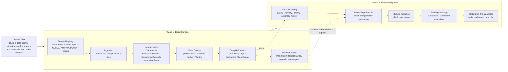

# Lattice

Lattice is an open-source data compiler for scientific and materials-domain training data.

## Overall Goal

The goal of Lattice is to build a data-centric infrastructure for foundation models in science and materials.

Instead of treating data collection as a one-off scraping task, Lattice treats data as a long-term asset:

- connect heterogeneous scientific sources
- normalize them into a stable schema
- preserve provenance, licensing, and dedup information
- compile them into reusable training-ready dataset views
- eventually learn how to select and use data more effectively

## Why We Need This

Scientific and materials data is currently fragmented across:

- papers
- preprints
- structured materials databases
- chemistry databases
- repositories
- patents
- educational resources

This creates three problems:

1. Useful data is hard to find and harder to unify.
2. Even after collection, most data is not directly training-ready.
3. Data selection and usage are still largely heuristic.

We need this project because model progress in scientific domains is increasingly bottlenecked by data quality, provenance, structure, and reuse, not just by model architecture.

## Phase 1

Phase 1 builds the **data compiler** itself.

The goal is to take heterogeneous raw sources and turn them into normalized, provenance-aware, training-ready data.

Phase 1 focuses on:

- source ingestion
- schema normalization
- provenance and license tracking
- deduplication and quality filtering
- dataset compilation into:
  - pretraining view
  - QA view
  - instruction view
  - knowledge view

The current repository is primarily implementing this phase.

## Phase 2

Phase 2 builds the **data intelligence layer** on top of Phase 1.

The goal is not just to compile data, but to understand which data is more valuable and how it should be used.

Phase 2 focuses on:

- data valuation
- task-conditioned data scoring
- mixture selection
- feeding strategy / curriculum optimization
- proxy experiments for predicting downstream utility

In short:

- Phase 1 answers: **How do we build high-quality scientific training data?**
- Phase 2 answers: **Which data should we use, and how should we use it?**

## Daily Updates

### 2026-04-13

- Created the standalone `lattice` repository and pushed the first public version.
- Implemented the first runnable Phase 1 compiler:
  - text / HTML / JSON / JSONL / optional PDF ingestion
  - schema normalization
  - provenance and dedup metadata
  - quality filtering
  - compiled dataset views
- Added the first materials example dataset and end-to-end tests.
- Added open-source scaffolding:
  - MIT license
  - contributing guide
  - changelog
  - CI workflow

### 2026-04-14

- Added a real-source demo fetcher for OpenAlex, arXiv, and PubChem.
- Added a starter source registry and storage architecture document.
- Added P0 materials source adapters for OQMD, NOMAD, and Materials Project.
- Verified:
  - OQMD and NOMAD can be fetched into raw records
  - fetched records can be compiled into Lattice dataset views
  - Materials Project skips safely when no API key is configured
- Reorganized the repository structure and moved planning documents into `docs/research/`.

## Phase 1 / Phase 2 Diagram

