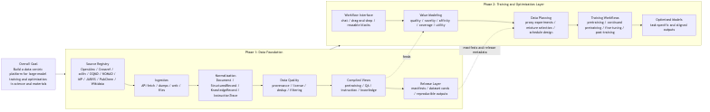

# Lattice

> EN: An open-source data-centric platform for large-model training and optimization in science and materials.  
> 中文：一个面向科学与材料领域大模型训练与优化的数据中心平台。

Lattice is a platform for building, organizing, and using high-quality training data across the large-model lifecycle: pretraining, continued pretraining, fine-tuning, and post-training.  
Lattice 的目标是围绕大模型全生命周期构建、组织和使用高质量训练数据，包括 pretraining、continued pretraining、fine-tuning 和 post-training。

It starts from the hardest part first: turning fragmented scientific sources into structured, provenance-aware, training-ready data.  
它首先解决最基础也最困难的问题：把分散的科学数据源转成结构化、可追踪、可直接用于训练的数据。

## Project Goal / 项目目标

The goal of Lattice is to build a platform that can automatically collect, process, organize, and use high-quality training data from many different sources, and make the full model-training workflow easier to operate.  
Lattice 的目标是构建一个平台，能够自动从多种数据来源收集、处理、组织和使用高质量训练数据，并让完整的大模型训练流程更容易被执行。

In the long run, Lattice should support:  
从长期看，Lattice 需要支持：

- pretraining from scratch
- continued pretraining on top of existing models
- task-specific fine-tuning
- safety and alignment optimization in post-training

And it should let users complete these workflows through:  
同时，它还应该允许用户通过下面的方式完成这些流程：

- conversational interaction
- drag-and-drop composition
- reusable pipeline blocks

The intended experience is that users can assemble large-model training and optimization workflows like building blocks, without needing to hand-write complex code for every step.  
理想状态下，用户可以像搭积木一样完成大模型训练与优化流程，而不需要为每一步深入编写复杂代码。

## Why This Platform Is Needed / 为什么需要这个平台

Today, high-quality model training in scientific domains is difficult for two reasons at once:  
今天，科学领域的大模型训练之所以困难，通常同时来自两个问题：

1. **The data problem / 数据问题**  
   Scientific and materials data is fragmented across papers, preprints, databases, repositories, patents, and educational resources.  
   科学与材料数据分散在论文、预印本、数据库、数据仓库、专利和教育资源中。

2. **The workflow problem / 工作流问题**  
   Even after data is collected, users still need to manually connect data preparation, pretraining, continued pretraining, fine-tuning, and post-training pipelines.  
   即使数据收集完成，用户仍然需要手动串联数据处理、pretraining、continued pretraining、fine-tuning 和 post-training 的流程。

This means that the bottleneck is not just model design. It is also:  
这意味着瓶颈不只是模型设计，还包括：

- how to gather data / 怎么收集数据
- how to standardize it / 怎么标准化数据
- how to track provenance and licensing / 怎么追踪来源和许可证
- how to turn it into training-ready views / 怎么把它转成训练视图
- how to connect it to downstream training workflows / 怎么接到后续训练流程里

Lattice is meant to solve both the data layer and the workflow layer, starting from data infrastructure and expanding into training orchestration.  
Lattice 试图同时解决数据层和工作流层的问题，先从数据基础设施做起，再扩展到训练编排层。

## Platform Structure / 平台结构

Lattice is organized in two phases.  
Lattice 目前分成两个阶段。

### Phase 1: Data Foundation / 数据基础层

Phase 1 builds the data engine of the platform.  
Phase 1 负责构建平台的数据引擎。

Its purpose is to automatically ingest heterogeneous sources and convert them into normalized, provenance-aware, reusable training data.  
它的目标是自动接入异构数据源，并将它们转换为规范化、可追踪、可复用的训练数据。

Phase 1 includes / Phase 1 包含：

- source registry and source adapters
- ingestion from APIs, files, web resources, and databases
- schema normalization
- provenance, licensing, and dedup tracking
- quality filtering and data cleaning
- compiled dataset views for:
  - pretraining
  - QA
  - instruction tuning
  - knowledge records

This is the part of the platform that is currently implemented in the repository.  
这也是当前仓库已经在实现并可运行的部分。

### Phase 2: Training and Optimization Layer / 训练与优化层

Phase 2 builds the model-training and optimization layer on top of Phase 1.  
Phase 2 在 Phase 1 之上构建模型训练与优化层。

Its purpose is to let users move from data preparation to end-to-end model improvement workflows.  
它的目标是让用户从数据准备自然过渡到端到端的模型训练和优化流程。

Phase 2 is intended to support / Phase 2 计划支持：

- pretraining
- continued pretraining
- fine-tuning
- post-training for safety and alignment
- data valuation and data selection
- mixture optimization and feeding strategy design
- conversational and low-code workflow control

In short / 简单说：

- Phase 1 answers: **How do we build high-quality training data?**  
  Phase 1 回答：**如何构建高质量训练数据？**
- Phase 2 answers: **How do we use that data to train and optimize models more easily and more effectively?**  
  Phase 2 回答：**如何更容易、更有效地用这些数据训练和优化模型？**

## Current Status / 当前状态

The repository is currently implementing **Phase 1** of the platform.  
当前仓库主要实现的是平台的 **Phase 1**。

What is already in place / 当前已经完成：

- a runnable compiler CLI
- a stable schema boundary
- provenance-aware normalization
- filtering and deduplication
- compiled dataset views
- a starter source registry
- real-source demo fetchers
- open-source adapters for:
  - OpenAlex
  - Crossref
  - arXiv
  - PubChem
  - OQMD
  - NOMAD
  - JARVIS
  - Wikidata
- Materials Project integration with API-key gating
- engine execution layer for:
  - local
  - Spark
  - Flink-compatible code path
- tests and CI

So today, Lattice is already functioning as the **data foundation layer** of the future platform, but it is not yet the full training platform described above.  
所以目前 Lattice 已经具备未来平台的 **数据基础层**，但还不是完整的训练平台。

## Daily Updates / 每日更新

### 2026-04-13

- Created the standalone `lattice` repository and pushed the first public version.
- Implemented the first runnable Phase 1 compiler:
  - text / HTML / JSON / JSONL / optional PDF ingestion
  - schema normalization
  - provenance and dedup metadata
  - quality filtering
  - compiled dataset views
- Added the first materials example dataset and end-to-end tests.
- Added open-source scaffolding:
  - MIT license
  - contributing guide
  - changelog
  - CI workflow

中文总结：

- 创建了独立的 `lattice` 仓库并完成首次公开推送。
- 实现了可运行的第一版 Phase 1 compiler。
- 加入了 materials 示例数据和端到端测试。
- 补齐了开源仓库基础设施。

### 2026-04-14

- Added a real-source demo fetcher for OpenAlex, arXiv, and PubChem.
- Added a starter source registry and storage architecture document.
- Added registry-driven P0 materials source adapters for OQMD, NOMAD, and Materials Project.
- Extended open-source source coverage with:
  - Crossref
  - Wikidata
  - JARVIS
- Extended the compiler so `KnowledgeRecord` sources can also flow into QA, instruction, and knowledge views.
- Marked PatentsView as an optional connector while the legacy API remains discontinued during ODP migration.
- Added a local execution layer that can compile normalized records with:
  - local Python execution
  - Spark local mode
  - a Flink-compatible execution path with runtime checks
- Verified local and Spark execution in the current environment.
- Reorganized the repository structure and moved planning documents into `docs/research/`.
- Added the Phase 1 / Phase 2 roadmap figure.

中文总结：

- 增加了真实 source demo 抓取能力。
- 建立了初版 source registry 和存储架构文档。
- 接入了多类开源 source adapter。
- 补上了本地执行层，并验证了 local 与 Spark 能跑通。
- 完成了 repo 整理和 Phase 图。

## Small Demo / 小型展示

### Demo A: Real-source data compilation / 真实数据源编译 demo

This demo fetches a small public sample from:

- OpenAlex
- arXiv
- PubChem

and compiles them into training-ready views.

Example result:

- input records: `4`
- kept records: `4`
- source coverage:
  - `arxiv: 1`
  - `openalex: 1`
  - `pubchem: 2`
- output views:
  - `pretrain_view: 4`
  - `qa_view: 10`
  - `instruction_view: 4`
  - `knowledge_view: 10`

Artifacts:

- [Real-source manifest](data/demo_compiled/solid_state/reports/manifest.json)

### Demo B: Local and Spark runtime execution / 本地与 Spark 执行 demo

This demo runs the same normalized runtime fixture through:

- local execution
- Spark local execution

and verifies that both produce the same filtered and compiled result.

Example result:

- input records: `4`
- kept records: `3`
- dropped:
  - `boilerplate: 1`
- schema counts:
  - `Document: 1`
  - `StructuredRecord: 1`
  - `KnowledgeRecord: 1`

Artifacts:

- [Local runtime manifest](outputs/runtime-local/reports/manifest.json)
- [Spark runtime manifest](outputs/runtime-spark/reports/manifest.json)

## Repository Structure / 仓库结构

- `src/lattice/`: core package
- `configs/`: source registry and fetch configuration
- `docs/`: architecture notes and research documents
- `docs/research/`: proposal, survey, and planning notes
- `examples/`: small sample inputs
- `tests/`: unit and end-to-end tests

## Roadmap / 路线图

Near-term priorities / 近期重点：

- expand open-source source coverage in Phase 1
- improve source registry and license gating
- build a stronger silver layer for cross-source alignment
- release a larger materials-domain dataset
- fully stabilize Flink runtime support

Long-term priorities / 长期重点：

- connect Phase 1 outputs to model training workflows
- support pretraining, continued pretraining, fine-tuning, and post-training
- add data valuation and mixture optimization
- add conversational and drag-and-drop workflow control

## Supporting Docs / 补充文档

- [Storage Architecture](docs/storage_architecture.md)
- [Engine Runtime Notes](docs/engines.md)
- [Research Notes Index](docs/research/README.md)
