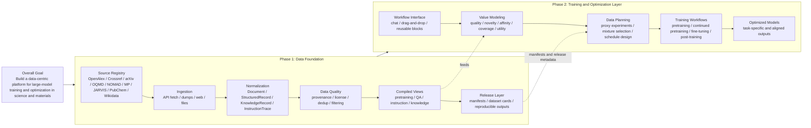

# Phase 1 / Phase 2 Roadmap

This diagram summarizes how Lattice moves from a data compiler in Phase 1 to a data intelligence layer in Phase 2.

```mermaid
flowchart LR
    G["Overall Goal<br/>Build a data-centric platform for large-model training and optimization in science and materials"]

    subgraph P1["Phase 1: Data Foundation"]
        S1["Source Registry<br/>OpenAlex / Crossref / arXiv / OQMD / NOMAD / MP / JARVIS / PubChem / Wikidata"]
        S2["Ingestion<br/>API fetch / dumps / web / files"]
        S3["Normalization<br/>Document / StructuredRecord / KnowledgeRecord / InstructionTrace"]
        S4["Data Quality<br/>provenance / license / dedup / filtering"]
        S5["Compiled Views<br/>pretraining / QA / instruction / knowledge"]
        S6["Release Layer<br/>manifests / dataset cards / reproducible outputs"]
        S1 --> S2 --> S3 --> S4 --> S5 --> S6
    end

    subgraph P2["Phase 2: Training and Optimization Layer"]
        T0["Workflow Interface<br/>chat / drag-and-drop / reusable blocks"]
        T1["Value Modeling<br/>quality / novelty / affinity / coverage / utility"]
        T2["Data Planning<br/>proxy experiments / mixture selection / schedule design"]
        T3["Training Workflows<br/>pretraining / continued pretraining / fine-tuning / post-training"]
        T4["Optimized Models<br/>task-specific and aligned outputs"]
        T0 --> T1 --> T2 --> T3 --> T4
    end

    G --> P1
    P1 --> P2
    S5 -. feeds .-> T1
    S6 -. manifests and release metadata .-> T2
```
